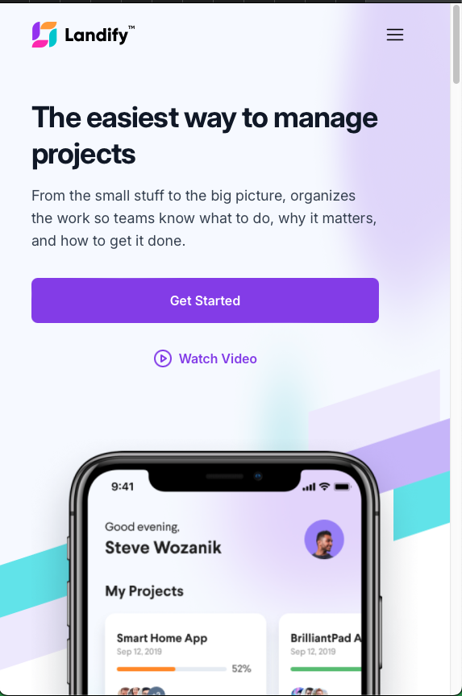

# Landify Design 1 - React Implementation

This project is a React implementation of the Landify Landing Page UI Kit. The UI design was provided by the Figma community and has been sliced and converted into a functional web application using React.

## 🎨 Design Reference

This project is based on the [Landify - Landing Page UI Kit v2](<https://www.figma.com/design/088L8rIAnc29ArpVGDNG5y/Landify---Landing-Page-UI-Kit-v2-(Community)?node-id=1973-6598&t=KM6f0RjBK3Yq0WT8-0>) from Figma Community.

## 📸 Screenshots

### Desktop Version

### Mobile Version

  
  

## 📄 License

This project is licensed under the MIT License. See the [LICENSE](LICENSE) file for more details.

## ✨ Acknowledgments

- Thanks to the Figma community for providing the Landify UI Kit.
